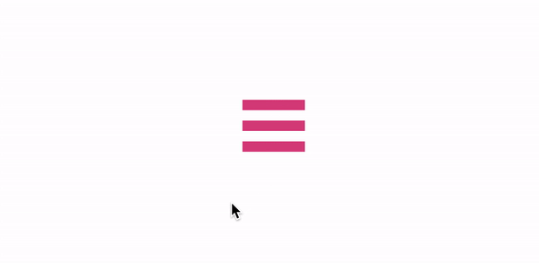

# Opdracht beschrijving

## Eindresultaat
Programmeer de volgende transitie van hamburger naar kruisje wanneer de gebruiker met de muis over het menu beweegt:

## Randvoorwaarden
* Het hamburger-menu bestaat uit één basis-element en twee pseudo-elementen
* De transities worden tweezijdig toegepast (zowel van niet-hover => hover als van hover => niet-hover) 

## Stappenplan
1. Pak de content van EdHub over transities erbij. 
2. Maak een container om de menu-balkjes heen in de HTML. We willen namelijk dat de animatie begint als de gebruiker zijn muis _ergens_ over het gehele "vierkant" beweegt, niet alleen over het middelste balkje.
3. Geef die container voor nu even een border in een gekke kleur zodat je goed ziet tot waar hij rijkt. De bedoeling is dat hij precies om de drie balkjes heen staat.
4. Als de gebruiker over de container hovert, willen we dat het middelste balkje langzaam verdwijnt.
5. Tevens mag het bovenste balkje naar beneden draaien en het onderste balkje naar beneden

## Gratis tips 🤘🏻 (alleen kijken als je vastloopt!)
* _Tip bij stap 3_: haal de margin van het `#menu` element weg en vervang het door padding op het `#container` element
* _Tip bij stap 4_: focus je eerst op de begin- en eindstaat voor je je bezig houdt met transities. Het begin is een zichtbaar balkje. Het eind is een onzichtbaar balkje.
* _Tip bij stap 4 - vervolg_: als je de `opacity` aanpast doe je dat voor het basis element, en automatisch ook voor de pseudo-elementen. Niet ideaal dus, want de buitenste heb je nog nodig. Ga eens op zoek naar wat je kunt doen met de _kleur_ van het middelste balkje.
* _Tip bij stap 5_: Benieuwd hoe je elementen kunt draaien? Google eens op `CSS transform Property`
